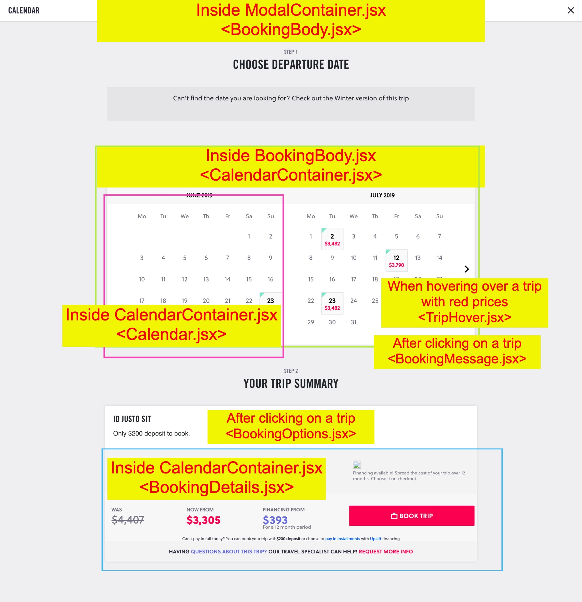
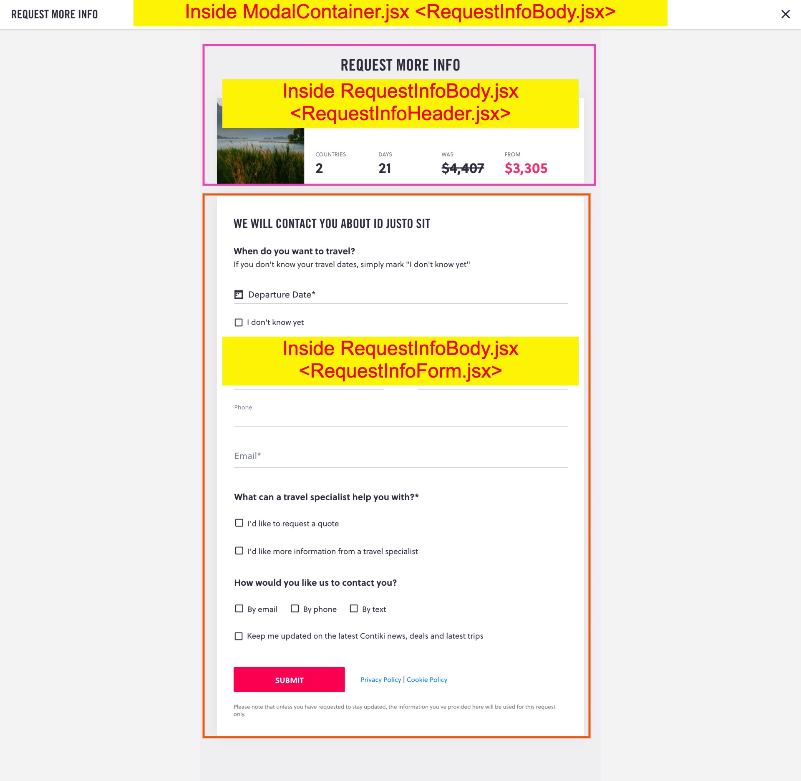

# Booking Component Documentation

> The Booking component includes a number of subcomponents. To facilitate easier navigation and understanding, we have included images with markups to indicate the corresponding JSX file for the subcomponent

## Table of Contents

1. [Main Page](#Main-Page)
2. [Booking Modal](#Booking-Modal)
3. [Form Modal](#Form-Modal)

## Main-Page
> The entire component is served in the `client/src/App.jsx` file.
> - All subcomponents reside in the `client/src/components` folder
> - !! Note that one subcomponent is not labeled below, the `TripFeatures.jsx`subcomponent is loaded in the `TripDescription.jsx` subcomponent

## Booking-Modal

> The booking form and the request more info forms utilize the same modal container (`ModalContainer.jsx`), which dynamically loads either `BookingBody.jsx` or `RequestInfoBody.jsx` depending on which button was clicked

## Form-Modal

